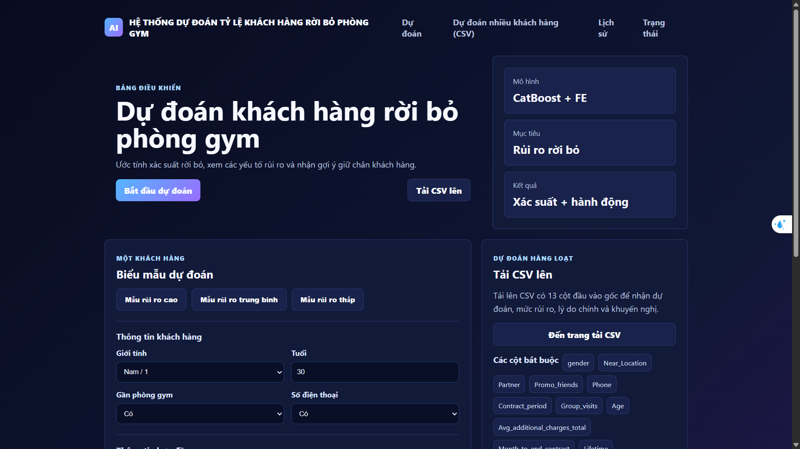



# Gym Customers Churn Prediction

Đồ án Machine Learning dự đoán khả năng khách hàng phòng gym rời bỏ dịch vụ (customer churn) dựa trên thông tin hợp đồng, hành vi tập luyện, mức chi tiêu và các đặc trưng liên quan đến mức độ gắn kết của khách hàng.

Project bao gồm quá trình phân tích dữ liệu, huấn luyện nhiều mô hình học máy, xử lý mất cân bằng dữ liệu, feature engineering, giải thích mô hình bằng SHAP và demo web dự đoán churn cho từng khách hàng hoặc theo file CSV.

## 1. Mục tiêu

- Phân tích các yếu tố ảnh hưởng đến churn của khách hàng phòng gym.
- Xây dựng mô hình phân loại dự đoán khách hàng có nguy cơ rời bỏ.
- So sánh nhiều thuật toán Machine Learning theo các metric phù hợp với bài toán churn.
- Cải thiện hiệu năng bằng feature engineering và các kỹ thuật xử lý mất cân bằng dữ liệu.
- Giải thích kết quả dự đoán bằng feature importance và SHAP.
- Triển khai demo web để nhập dữ liệu và nhận kết quả dự đoán churn.

## 2. Dữ liệu

Dữ liệu chính nằm trong thư mục `Data/`.

- `Data/gym_churn_us.csv`: bộ dữ liệu huấn luyện và phân tích chính.
- `Data/test.csv`: dữ liệu mẫu dùng để kiểm thử batch prediction.

Target:

- `Churn = 0`: khách hàng không rời bỏ.
- `Churn = 1`: khách hàng rời bỏ.

Các cột đầu vào chính:

- `gender`
- `Near_Location`
- `Partner`
- `Promo_friends`
- `Phone`
- `Contract_period`
- `Group_visits`
- `Age`
- `Avg_additional_charges_total`
- `Month_to_end_contract`
- `Lifetime`
- `Avg_class_frequency_total`
- `Avg_class_frequency_current_month`

## 3. Cấu trúc thư mục

```text
.
├── Data/
│   ├── gym_churn_us.csv
│   └── test.csv
├── Notebooks/
│   ├── 01_EDA.ipynb
│   ├── 02_baseline_models.ipynb
│   ├── 03_feature_engineering_models.ipynb
│   ├── 04_imbalance_handling_models.ipynb
│   └── 05_shap_explainability.ipynb
├── Models/
│   ├── baseline_model_metrics.csv
│   ├── best_baseline_model.pkl
│   ├── best_feature_engineering_model.pkl
│   ├── best_imbalance_model.pkl
│   └── catboost_fe_shap_model.pkl
├── Reports/
│   ├── *.csv
│   └── figures/
├── OutputForReports/
├── Demo/
│   ├── app.py
│   ├── requirements.txt
│   ├── models/
│   ├── utils/
│   ├── templates/
│   ├── static/
│   ├── uploads/
│   └── outputs/
├── CS114_Report_Nhom5.pdf
├── CS114_Slide_Nhom5.pdf
├── feature_engineering_formular.txt
└── Readme.txt
```

## 4. Quy trình thực hiện

Pipeline tổng quát:

```text
Raw data
-> EDA
-> Train/test split
-> Baseline modeling
-> Feature engineering
-> Imbalance handling
-> Model evaluation
-> SHAP explainability
-> Export best model
-> Demo prediction app
```

Các notebook:

1. `01_EDA.ipynb`
   - Kiểm tra dữ liệu, missing values, duplicated rows.
   - Phân tích phân phối target `Churn`.
   - Phân tích univariate và bivariate.
   - Vẽ heatmap tương quan và rút insight ban đầu.

2. `02_baseline_models.ipynb`
   - Huấn luyện các mô hình baseline.
   - So sánh Logistic Regression, KNN, Decision Tree, Random Forest, Extra Trees, Gradient Boosting, XGBoost, LightGBM, CatBoost.
   - Đánh giá bằng Accuracy, Precision, Recall, F1 và ROC-AUC.

3. `03_feature_engineering_models.ipynb`
   - Tạo các đặc trưng mới từ hành vi tập luyện, hợp đồng, chi tiêu và mức độ gắn kết.
   - So sánh hiệu năng trước và sau feature engineering.

4. `04_imbalance_handling_models.ipynb`
   - Thử các chiến lược xử lý mất cân bằng dữ liệu.
   - So sánh No Handling, Class Weight, RandomOverSampler, SMOTE, BorderlineSMOTE, ADASYN.

5. `05_shap_explainability.ipynb`
   - Phân tích feature importance.
   - Giải thích mô hình bằng SHAP.
   - Phân tích các yếu tố chính làm tăng hoặc giảm nguy cơ churn.

## 5. Feature engineering

Một số nhóm đặc trưng được tạo thêm:

- Mức thay đổi tần suất tập luyện:
  - `frequency_drop`
  - `frequency_ratio_current_total`
  - `low_current_activity`
  - `high_current_activity`

- Mức độ gắn kết:
  - `engagement_score`
  - `total_engagement_score`
  - `loyalty_score`
  - `social_commitment_score`

- Trạng thái hợp đồng:
  - `contract_remaining_ratio`
  - `is_contract_ending`
  - `is_short_contract`
  - `is_long_contract`
  - `renewal_pressure_score`

- Chi tiêu:
  - `spending_per_month`
  - `high_spending`
  - `low_spending`
  - `log_additional_charges`

- Tổ hợp rủi ro:
  - `new_low_activity`
  - `ending_low_activity`
  - `short_contract_low_activity`
  - `no_group_low_activity`
  - `far_low_activity`

Danh sách công thức chi tiết có trong file `feature_engineering_formular.txt` và module `Demo/utils/feature_engineering.py`.

## 6. Kết quả chính

### Baseline models

Một số kết quả baseline tốt nhất:

| Model | Accuracy | Precision | Recall | F1 | ROC-AUC |
|---|---:|---:|---:|---:|---:|
| CatBoost | 0.9475 | 0.9167 | 0.8821 | 0.8990 | 0.9826 |
| XGBoost | 0.9450 | 0.9078 | 0.8821 | 0.8947 | 0.9800 |
| LightGBM | 0.9425 | 0.9150 | 0.8632 | 0.8883 | 0.9775 |

### Sau feature engineering

Feature engineering giúp cải thiện rõ rệt nhiều mô hình. Ví dụ:

| Model | Original ROC-AUC | FE ROC-AUC | Original F1 | FE F1 |
|---|---:|---:|---:|---:|
| Random Forest | 0.9683 | 0.9884 | 0.8564 | 0.9372 |
| Extra Trees | 0.9579 | 0.9824 | 0.8305 | 0.9017 |
| CatBoost | 0.9826 | 0.9897 | 0.8990 | 0.9294 |

### Xử lý imbalance

Kết quả tốt nhất trong file `Reports/imbalance_handling_results.csv`:

| Experiment | Strategy | Model | Accuracy | Recall churn | F1 churn | ROC-AUC |
|---|---|---|---:|---:|---:|---:|
| FE Only | No Handling | Random Forest | 0.9650 | 0.9104 | 0.9324 | 0.9885 |
| FE + Class Weight | Class Weight | Random Forest | 0.9650 | 0.9057 | 0.9320 | 0.9885 |
| FE + RandomOverSampler | RandomOverSampler | XGBoost | 0.9613 | 0.9245 | 0.9267 | 0.9856 |

Trong bài toán churn, không nên chỉ nhìn Accuracy. Các metric quan trọng hơn là Recall/F1 của class `Churn = 1`, ROC-AUC và PR-AUC.

## 7. Giải thích mô hình

Theo kết quả SHAP, các đặc trưng có ảnh hưởng mạnh gồm:

- `frequency_drop`
- `Age`
- `loyalty_score`
- `frequency_ratio_current_total`
- `engagement_score`
- `total_engagement_score`
- `Lifetime`
- `Month_to_end_contract`
- `Avg_class_frequency_current_month`

Insight nghiệp vụ chính:

- Khách hàng giảm tần suất tập luyện trong tháng hiện tại có nguy cơ churn cao hơn.
- Khách hàng mới, thời gian gắn bó thấp hoặc sắp hết hạn hợp đồng thường có rủi ro cao.
- Mức độ gắn kết qua group visits, khuyến mãi bạn bè và tần suất tập luyện giúp giảm nguy cơ churn.
- Các đặc trưng kết hợp từ hành vi tập luyện và trạng thái hợp đồng có giá trị dự đoán tốt.

## 8. Cách chạy notebook

Khuyến nghị dùng Python 3.11.

Tạo virtual environment ở thư mục gốc project:

```powershell
py -3.11 -m venv .venv
.\.venv\Scripts\Activate.ps1
python -m pip install --upgrade pip
```

Cài các thư viện cần thiết. Nếu chỉ chạy demo, dùng file trong `Demo/requirements.txt`:

```powershell
pip install -r Demo\requirements.txt
```

Nếu chạy toàn bộ notebook, cần thêm các thư viện thường dùng cho phân tích và huấn luyện như:

```powershell
pip install matplotlib seaborn jupyter xgboost lightgbm imbalanced-learn openpyxl
```

Mở Jupyter Notebook:

```powershell
jupyter notebook
```

Sau đó chạy lần lượt các notebook trong thư mục `Notebooks/`.

## 9. Cách chạy demo web

Demo web nằm trong thư mục `Demo/` và sử dụng FastAPI.

Các bước chạy:

```powershell
cd Demo
py -3.11 -m venv .venv
.\.venv\Scripts\Activate.ps1
python -m pip install --upgrade pip
pip install -r requirements.txt
python -m uvicorn app:app --reload
```

Mở trình duyệt tại:

```text
http://127.0.0.1:8000
```

Các chức năng chính của demo:

- Dự đoán churn cho một khách hàng.
- Upload CSV để dự đoán hàng loạt.
- Xuất file kết quả dự đoán.
- Hiển thị xác suất churn, nhãn dự đoán, mức rủi ro, lý do chính và khuyến nghị giữ chân khách hàng.

File CSV dùng cho batch prediction cần có đủ các cột đầu vào gốc:

```text
gender
Near_Location
Partner
Promo_friends
Phone
Contract_period
Group_visits
Age
Avg_additional_charges_total
Month_to_end_contract
Lifetime
Avg_class_frequency_total
Avg_class_frequency_current_month
```

Kết quả batch sẽ được lưu trong:

```text
Demo/outputs/
```

## 10. Model đã lưu

Các model đã train nằm trong thư mục `Models/`:

- `best_baseline_model.pkl`: model baseline tốt nhất.
- `best_feature_engineering_model.pkl`: model tốt nhất sau feature engineering.
- `best_imbalance_model.pkl`: model tốt nhất sau thử nghiệm imbalance handling.
- `catboost_fe_shap_model.pkl`: model phục vụ phân tích SHAP.

Demo sử dụng model tại:

```text
Demo/models/best_feature_engineering_model.pkl
```

## 11. Báo cáo và slide

- Báo cáo: `CS114_Report_Nhom5.pdf`
- Slide trình bày: `CS114_Slide_Nhom5.pdf`
- Hình ảnh và bảng kết quả: `Reports/` và `OutputForReports/`

## 12. Ghi chú

- Cần split train/test trước khi xử lý dữ liệu để tránh data leakage.
- Các kỹ thuật oversampling như SMOTE chỉ được fit trên tập train.
- Với bài toán churn, ưu tiên phát hiện tốt khách hàng có nguy cơ rời bỏ thay vì chỉ tối ưu Accuracy.
- Kết quả dự đoán nên được dùng như công cụ hỗ trợ ra quyết định, kết hợp thêm hiểu biết nghiệp vụ về khách hàng và chiến lược chăm sóc.
